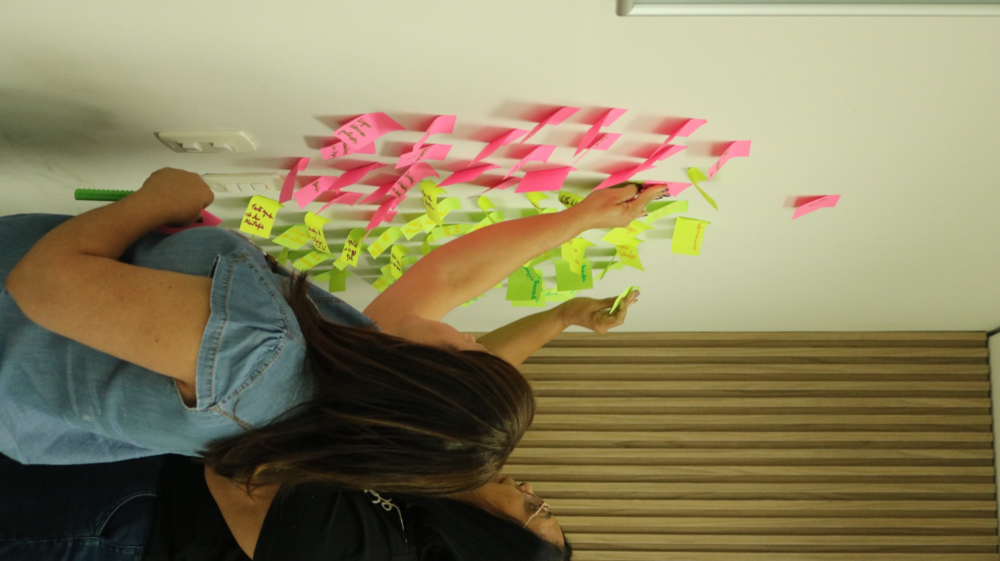
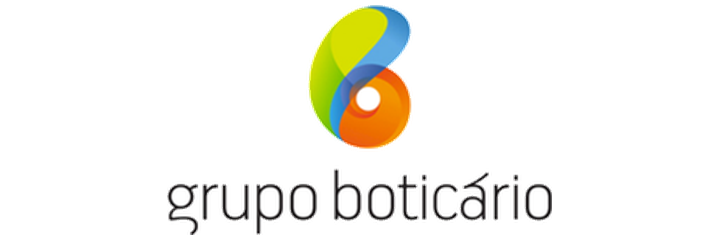

# Slide 07, Sobre nós (a DIGGING): especificação da revisão

> Escrito em **23/08/2026**, a partir do ditado da Mallu. Este arquivo **especifica**, não aplica.
> O `index-v4.html` e o `pitch.css` não foram tocados: alguém está editando o HTML em paralelo.
> Régua da rodada: **ela gosta do slide como está**. Isto é enxugar, não redesenhar.
> Nenhuma proposta aqui muda o layout, a grade, os logos ou o fecho.

---

## 1. O que sai, o que entra, o que fica

| Bloco | Hoje | Decisão | Observação |
|---|---|---|---|
| `h2.t-g` (título) | "A empresa que opera a PAAPS fatura desde 2003." | **FICA, intocado** | Ela confirmou no ditado |
| `p.lead`, 1ª frase | "Somos uma **consultoria** de desenvolvimento humano que atende o mercado corporativo desde 2003." | **TROCA** | Duas formulações concorrentes, ver §6, Q1 |
| `p.lead`, 2ª frase | "A PAAPS é a transposição desse método para a rede pública," | **FICA, com acréscimo** | Ganha "com escala", ver §6, Q3 |
| `p.lead`, 3ª oração | "e entrou no contrato social em abril de 2026, na mesma empresa e com as mesmas sócias" | **SAI** | Corte pedido no ditado |
| `p.lead`, frase nova | não existe | **ENTRA** | "A DIGGING até então executava um trabalho artesanal, que atende poucos clientes." Discordância de tempo verbal, ver §6, Q4 |
| `p.dig__fat` | "Trabalho artesanal, que atende poucos clientes **de cada vez**: R$ 1,16 milhão faturado nos últimos 4 anos." | **ENXUGA para só o número** | O trecho artesanal sobe para o `.lead`; o "de cada vez" ela cortou |
| `div.dig__dir` (3 credenciais) | Pão de Açúcar, FEBRABAN, 99% feminino | **FICA, intocado** | Não foi pedido |
| `.dig__dados`, célula 1 | CNPJ 05.983.700/0001-67 | **FICA** | É o dado que ancora tudo |
| `.dig__dados`, célula 2 | "Situação cadastral ativa desde 23/10/2003" | **SAI** | Corte pedido: já está no título, e a Serasa acha numa busca mínima |
| `.dig__dados`, célula 3 | "CNAE 86.50-0-03 psicologia e psicanálise" | **SAI** | Idem |
| `.dig__dados`, célula nova | não existe | **DEPENDE DE DECISÃO** | O "a CNPJ e o CNPJ feito" do ditado está ambíguo, ver §6, Q2 |
| `h2.dig__fecho` | "A ferramenta mais valiosa... É isso que a PAAPS faz." | **FICA, intocado** | Não foi pedido |
| `div.dig__logos` (12 logos) | fila de clientes | **FICA, intocado** | Só o rótulo na `.fonte` muda |
| `span.fonte` | 4 blocos, com datas de emissão e a palavra "assinados" | **ENXUGA** | §3.4 e §5 das pendências. Nenhum dado fica sem fonte falseável |
| Foto de fundo | `treino-vertical.jpg` | **AJUSTE, com limite físico** | Ver §4. Não existe zoom a reduzir: o corte vem do formato da foto |

---

## 2. HTML proposto, colável

Substitui as linhas do `<section id="sdig">`. As partes que ela ainda precisa decidir estão
marcadas em comentário HTML: escolher uma e apagar a outra antes de aplicar.

```html
<!-- 07 SOBRE NOS: A DIGGING -->
<section class="slide veu-denso" id="sdig">
  <div class="slide__foto"></div>
  <p class="canto rev">Sobre nós</p>
  <div class="slide__c c--centro dig">
    <div class="dig__topo rev rev--1">
      <div class="dig__esq">
        <h2 class="t-g">A empresa que opera a PAAPS fatura desde 2003.</h2>

        <!-- ===== OPÇÃO A do lead (ditado de 23/08, a mais recente) ===== -->
        <p class="lead">Somos uma empresa de consultoria de desenvolvimento humano que atende o mercado corporativo desde 2003. A DIGGING até então executava um trabalho artesanal, que atendia poucos clientes. A PAAPS é a transposição desse método para a rede pública, com escala.</p>

        <!-- ===== OPÇÃO B do lead (correção dela em 22/08, §3.4 das pendências) =====
        <p class="lead">Não somos uma consultoria de desenvolvimento humano. Somos uma <b>empresa</b> de desenvolvimento humano que atende o mercado corporativo desde 2003, <b>no modelo de consultoria</b>. A DIGGING até então executava um trabalho artesanal, que atendia poucos clientes. A PAAPS é a transposição desse método para a rede pública, com escala.</p>
        ===== fim da opção B ===== -->

        <p class="dig__fat"><b>R$ 1,16 milhão</b> faturado nos quatro exercícios fechados, de 2022 a 2025.</p>
      </div>
      <div class="dig__dir">
        <p class="dig__cargo">Ex-diretoria de planejamento estratégico do <b>Grupo Pão de Açúcar</b>.</p>
        <p class="dig__cargo">Ex-diretoria financeira da <b>FEBRABAN</b>.</p>
        <p class="dig__cargo">Sócios do mesmo CNPJ, com <b>99% de participação feminina</b>.</p>
      </div>
    </div>

    <!-- ===== OPÇÃO (b) dos dados: CNPJ + respaldo contábil. Recomendada. ===== -->
    <div class="dig__dados rev rev--2">
      <span><b>CNPJ</b> 05.983.700/0001-67</span>
      <span><b>Contabilidade</b> ADR, André Conceição Silva, CRC 214145/O-9</span>
    </div>

    <!-- ===== OPÇÃO (a) dos dados: só o número do CNPJ =====
    <div class="dig__dados rev rev--2">
      <span><b>CNPJ</b> 05.983.700/0001-67</span>
    </div>
    ===== fim da opção (a) ===== -->

    <h2 class="dig__fecho rev rev--2">A ferramenta mais valiosa de desenvolvimento humano do mundo empresarial nunca chegou a quem sustenta a rede pública. <span class="destaque">É isso que a PAAPS faz.</span></h2>
    <div class="dig__logos rev rev--3"></div>
  </div>
  <span class="slide__n">07</span>
  <span class="fonte">DREs e balanços patrimoniais dos exercícios de 2022 a 2025, ADR Empresa de Serviços Contábeis, CRC 214145/O-9 · Cartão CNPJ e QSA, Receita Federal · Certidão de Inteiro Teor da 8ª alteração contratual, JUCESP · Logos: portfólio de clientes atendidos pela consultoria.</span>
</section>
```

### Por que a ordem das frases do lead mudou

O ditado dela põe o "com escala" na segunda frase e depois **acrescenta** a frase do trabalho
artesanal. Aplicado literalmente nessa ordem, o texto anuncia a escala e só depois volta no
tempo para dizer que antes era artesanal, o que quebra a linha do tempo. Na ordem proposta a
frase caminha: **atende o mercado corporativo desde 2003**, antes disso era artesanal e atendia
poucos clientes, **e só então** a transposição para a rede pública é o que muda o alcance. As
palavras são as dela; só a sequência é outra. Se ela preferir a ordem literal do ditado, é trocar
a segunda e a terceira frase de lugar, e nada mais quebra.

### O que a `.fonte` perdeu e por que continua falseável

Saíram: a palavra "assinados pela sócia e pelo contador", a data de emissão do cartão CNPJ
(13/08/2026) e a data da certidão da JUCESP (27/04/2026). Continuam de pé o **período dos
demonstrativos** (2022 a 2025), o **nome do escritório e o número do CRC**, e o **órgão emissor**
de cada documento (Receita Federal, JUCESP). Com CRC e órgão emissor, qualquer avaliador confere
numa busca simples. Se ela escolher a opção (b) dos dados, o CRC aparece duas vezes, no corpo e
na fonte: nesse caso a `.fonte` pode ficar só com "ADR Empresa de Serviços Contábeis", sem repetir
o número. É decisão de acabamento, não de conteúdo.

---

## 3. Conferência do R$ 1,16 milhão

**Fonte:** `ANALISE-FINANCEIRA-DIGGING.md`, versão 3 de 22/08/2026, Parte 0, tabela "Receita e
resultado". Ela mesma registra que refez a conta de cada exercício a partir da receita e das
despesas do próprio DRE, e que os quatro fecham na casa dos centavos. Documentos de origem: DREs
2022-2023, 2023-2024 e 2024-2025 e os balanços dos mesmos pares, do escritório ADR, CRC 214145/O-9.

| Exercício | Receita bruta de serviços | Documento |
|---|---|---|
| 2022 | R$ 119.928,00 | DRE 2022-2023 |
| 2023 | R$ 377.019,03 | DRE 2022-2023 e 2023-2024 |
| 2024 | R$ 372.036,00 | DRE 2023-2024 e 2024-2025 |
| 2025 | R$ 290.934,99 | DRE 2024-2025 |
| **Soma** | **R$ 1.159.918,02** | |

R$ 1.159.918,02 arredonda para **R$ 1,16 milhão**. **O número está certo e pode ficar.**

### O que não está certo é a expressão "nos últimos quatro anos"

Estamos em agosto de 2026. "Os últimos quatro anos" lidos ao pé da letra são 2023, 2024, 2025 e
2026, e 2026 não tem exercício fechado nem DRE. O período que soma R$ 1,16 milhão é **2022 a
2025**, que são os quatro últimos exercícios **encerrados**. A correção é de duas palavras e
fecha a brecha: **"nos quatro exercícios fechados, de 2022 a 2025"**. É essa a forma no HTML
proposto acima.

### Dois cuidados que o número carrega, e que não vão para o slide

Registrados aqui para ela não ser pega de surpresa numa pergunta:

1. **Nada desses R$ 1,16 milhão é PAAPS.** É 100% operação DIGGING no mercado privado. A PAAPS
   entrou no objeto social em 01/04/2026 e nunca faturou. O slide já está certo nisso, porque o
   título fala da "empresa que opera a PAAPS", não da PAAPS. Só não pode escorregar na fala.
2. **A série ano a ano tem dois buracos:** 2022 fatura um terço dos outros anos e fecha com
   prejuízo de R$ 643,44; 2025 cai 22% em relação a 2024. O total acumulado não tem esse problema
   e é igualmente verdadeiro, e é por isso que o slide mostra o total, nunca a série.

---

## 4. A foto: o que dá e o que não dá para revelar

### O diagnóstico, que muda o pedido

Não existe zoom aplicado a essa foto para reduzir. O CSS do slide 07 não tem nenhuma regra
própria de foto: vale só a regra geral, `.slide__foto img{width:100%;height:100%;object-fit:cover}`,
com `object-position` no padrão (centro) e uma animação de entrada de `scale(1.06)` para
`scale(1)` em 2,4s, que termina em escala 1 e some do PDF.

O corte não vem de um `scale()`. Vem do **formato do arquivo**:

| | valor |
|---|---|
| Arquivo | `../home/img/paaps/treino-vertical.jpg` |
| Dimensão real | **1122 x 2000 px, retrato** (proporção 0,561) |
| Formato do slide | 16/9 (proporção 1,778) |
| Ampliação imposta pelo `object-fit:cover` | **3,17 vezes** |
| Fatia da altura da foto que aparece na tela | **31,6%**, cerca de 631 px dos 2000 |

> Cuidado de leitura: o `sips` do macOS reporta "2000 x 1122" para esse arquivo, mas o
> `kMDItemPixelWidth` é 1122 e o `kMDItemPixelHeight` é 2000. A foto é retrato. As outras duas
> do mesmo conjunto, `treino-horizontal.jpg` e `treino-sala.jpg`, são paisagem de verdade
> (2000 x 1122), mas são **outra cena**: uma roda sentada em sala de reunião, não o painel de
> post-its. Não servem de troca direta.

### O limite físico, dito sem rodeio

Foto retrato 9:16 dentro de moldura 16:9 que a foto preenche inteira: **31,6% da altura é tudo o
que cabe.** Mexer no enquadramento **move a janela, não a aumenta.** É a mesma parede que o
slide 16 já bateu, e está registrada na §5 das pendências.

### A alavanca real, com valores

`object-position`, que hoje está no padrão `center` (50%). Com janela de 631 px em 2000 px de
altura, o topo da janela cai em `posição% x 1369 px`:

| `object-position` | Faixa visível da foto | O que entra e o que sai |
|---|---|---|
| `center 50%` (**atual**) | px 684 a 1316 | As mãos nos post-its, a cabeça da profissional de camisa jeans e o rosto da profissional de óculos. É a faixa mais cheia da foto |
| `center 46%` (**única troca que vale testar**) | px 630 a 1261 | Ganha uma fita a mais do campo de post-its acima das mãos, sem perder nenhum dos dois rostos |
| `center 40%` | px 548 a 1179 | Ganha o campo de post-its, mas corta a metade de baixo dos dois rostos |
| `center 60%` | px 821 a 1452 | Perde as mãos, ganha o torso de camisa jeans e o interruptor da parede. Pior |

Regra proposta, uma linha, no bloco do slide 07 do `pitch.css`:

```css
#sdig .slide__foto img{object-position:center 46%}
```

**Não apliquei.** E é honesto dizer: o ganho é pequeno, porque o centro já é quase o melhor corte
possível dessa foto.

### Sobre ver se ela aparece na cena

Isso o enquadramento não resolve, e o arquivo já responde. A foto inteira, de cima a baixo, tem
**duas pessoas e só**: em primeiro plano, de costas, uma profissional de cabelo castanho longo e
camisa jeans, com um marcador na mão; atrás dela, uma profissional de cabelo preto liso, óculos e
blusa preta, olhando para o painel. As duas estão de perfil ou de costas, e nenhum rosto aparece
de frente. Fora da faixa que o slide mostra não há nenhuma terceira pessoa: acima é parede branca
com post-its e o painel ripado de madeira, abaixo é o torso e a calça das mesmas duas. **Abrir o
arquivo no Preview é o jeito de ela confirmar em dez segundos**, e é o que eu recomendo antes de
mexer em qualquer valor de CSS.

### Duas saídas que existem, e que eu não proponho

Registro para ela saber que foram consideradas e por que ficaram de fora:

- **`object-fit:contain`** mostraria a foto inteira, mas ela ocuparia 31,6% da largura do slide, com
  duas faixas vazias nas laterais. Quebra o sistema de foto sangrada do deck inteiro.
- **`transform:scale(.5)`** revelaria 63% da altura, mas encolhe a largura junto e vira um painel
  centralizado. É redesenho de slide, e ela pediu o contrário.

Se em algum momento ela quiser mesmo a cena aberta, o caminho não é CSS: é **outra foto do mesmo
dia, na horizontal**, procurada em `insumos-compartilhados/fotos/`.

---

## 5. CSS novo

Nenhum, para a copy. As opções (a) e (b) do `.dig__dados` funcionam sem tocar em nada, porque o
bloco é `display:flex;flex-wrap:wrap`: com duas células ele fica equilibrado, e com uma só a
célula encosta à esquerda sob o filete tracejado.

**Um alerta de acabamento, para quem for aplicar:** com uma célula só, o filete tracejado
(`border-top:1px dashed`) atravessa o slide inteiro para sustentar uma linha curta, e fica
desproporcional. É mais um argumento a favor da opção (b), que enche a faixa. Se ela escolher a
opção (a), medir com a régua da skill `ajuste-fino-tipografico` antes de dar por pronto.

Única regra opcional, se ela aprovar o ajuste de foto da §4:

```css
#sdig .slide__foto img{object-position:center 46%}
```

---

## 6. Perguntas abertas para a Mallu

### Decisões de copy

**Q1. "Empresa de consultoria" ou "empresa no modelo de consultoria"?** As duas são dela, em
dias diferentes, e não dizem a mesma coisa.

| | Formulação | Quando |
|---|---|---|
| **A** | "Somos uma **empresa de consultoria** de desenvolvimento humano que atende o mercado corporativo desde 2003." | **23/08/2026, a mais recente**, ditado desta rodada |
| **B** | "Não somos uma consultoria de desenvolvimento humano. Somos uma **empresa** de desenvolvimento humano que atende o mercado corporativo desde 2003, **no modelo de consultoria**." | 22/08/2026, §3.4 das pendências, onde ela corrigiu a si mesma |

O que pesa de cada lado:

- **A é mais recente e é uma linha só.** Mas ela reabre exatamente a palavra que a B tinha ido lá
  corrigir: "empresa de consultoria" volta a dizer, na prática, "consultoria".
- **B guarda a distinção que ela quis fazer**, e o "não é X, é Y" dela passa no teste da casa,
  porque o X negado é uma crença que alguém tem de verdade: o próprio deck dizia "consultoria" até
  ontem, e é assim que a Serasa vai ler a empresa. Mas B gasta a **única** negação permitida na
  peça e ocupa quase o dobro de linhas num slide que ela mandou enxugar.
- Ela mesma disse, na §3.4, que a frase "ainda precisa ser melhorada". Nenhuma das duas está
  fechada.

**Não escolhi por ela.** O HTML da §2 traz A ativa, por ser a mais recente, e B comentada logo
abaixo, pronta para trocar.

**Q1b, dentro da mesma frase.** A §3.4 mandava cortar o "desde 2003" repetido no subtítulo,
porque ele já está no título ("fatura desde 2003"). As duas formulações do Q1 repetem. Mantive a
repetição porque ela reditou assim hoje, mas fica o registro: se ela quiser o corte, a frase vira
"Somos uma empresa de consultoria de desenvolvimento humano que atende o mercado corporativo."

**Q2. O que era "a CNPJ e o CNPJ feito"?** A transcrição do ditado está corrompida nesse ponto e
eu não vou chutar. Três leituras possíveis:

- **(a) Só o número do CNPJ.** O bloco fica com uma célula. É a leitura mais literal do que sobrou
  na transcrição, e a mais coerente com o pedido geral de enxugar.
- **(b) O CNPJ mais o respaldo contábil, com nome do escritório e número do CRC.** É o que a §3.4
  mandava manter em forma menor, e o segundo "CNPJ feito" pode muito bem ser "o balanço feito"
  pelo escritório. **É a que eu recomendo**, por dois motivos: enche a faixa que ficou vazia com
  os dois cortes, e contabilidade com nome e registro em São Paulo é exatamente o tipo de dado
  que um avaliador de habilitação procura.
- **(c) "O CNPJ e o CNAE".** Descartei, porque no mesmo ditado ela mandou cortar o CNAE. Registro
  só para constar que foi considerada.

O HTML da §2 traz (b) ativa e (a) comentada.

**Q3. A palavra "escala" fica?** A regra da casa proíbe "escala" como jargão de crescimento, e ela
mesma tem essa proibição escrita. Aqui a palavra veio da boca dela e tem sentido operacional
concreto: atender muitos municípios ao mesmo tempo, em vez de poucos clientes por vez. Dois fatos
a favor de manter:

1. O contraste que dá sentido à palavra está na frase anterior, escrita por ela: "um trabalho
   artesanal, que atendia poucos clientes". Com esse antecedente, "com escala" lê como alcance, não
   como promessa de crescimento.
2. "Escala" já está no deck pela mão dela, no slide 16, na frase literal "A escala conta com uso
   seguro de Inteligência Artificial para operações". Tirar do 07 e manter no 16 seria incoerente.

**Recomendo manter "com escala".** Se ela achar que pega mal, a alternativa que diz a mesma coisa
sem a palavra é: "A PAAPS é a transposição desse método para a rede pública, agora para muitos
municípios ao mesmo tempo." É mais longa e mais explicativa, e por isso é a segunda opção, não a
primeira.

**Q4. A frase do trabalho artesanal, na forma ditada ou corrigida?** Ela ditou:

> "A DIGGING até então executava um trabalho artesanal, que **atende** poucos clientes."

"Executava" está no passado e "atende" no presente, na mesma oração. A correção mínima, que muda
uma letra e nada mais:

> "A DIGGING até então executava um trabalho artesanal, que **atendia** poucos clientes."

É a forma que está no HTML da §2. **Ela decide se aceita ou se quer a forma ditada literal.**

E vai junto um alerta que não é de gramática, é de leitura: **"até então executava" diz que a
DIGGING parou.** Ela não parou. A DIGGING é quem fatura hoje, é ela que banca o ciclo longo da
venda pública, e a PAAPS ainda não faturou nada. Se um avaliador ler que a operação que sustenta
a empresa é passado, o argumento do slide se enfraquece justamente onde ele é mais forte. Duas
saídas, se ela concordar com o risco:

- **"A DIGGING faz um trabalho artesanal, que atende poucos clientes."** Presente, sem discordância,
  sem sugerir encerramento. Perde o "até então".
- **"O trabalho da DIGGING é artesanal e atende poucos clientes."** Idem, e mais curta.

Ela cortou o "de cada vez" no ditado, então nenhuma das versões acima o traz de volta.

**Q5. A ordem das três frases do lead.** Proposta na §2: corporativo desde 2003, depois artesanal
e poucos clientes, e **só então** a transposição com escala. É diferente da ordem ditada, que põe
a transposição antes da frase artesanal. O motivo está explicado na §2. **Confirmar.**

### Decisões de número

**Q6. "Nos últimos quatro anos" vira "nos quatro exercícios fechados, de 2022 a 2025"?** O valor
R$ 1,16 milhão está conferido e certo (§3). O que não sobrevive a leitura atenta é a expressão do
período: em agosto de 2026, "os últimos quatro anos" inclui 2026, que não tem DRE. **Recomendo a
troca.** É o único ponto do slide onde um avaliador consegue apontar erro factual.

**Q7. O R$ 1,16 milhão continua em algarismo, e "quatro anos" por extenso?** Hoje o slide escreve
"últimos 4 anos", em algarismo. A proposta da §2 escreve "quatro exercícios fechados, de 2022 a
2025", com o numeral por extenso e as datas em algarismo, que é o padrão de leitura mais limpo:
o único número que salta na linha continua sendo o R$ 1,16 milhão, em amarelo e em League Spartan.
**Confirmar se ela gosta assim.**

**Q8. O CRC aparece duas vezes ou uma?** Se ela escolher a opção (b) do Q2, o CRC 214145/O-9 fica
no corpo do slide e na `.fonte`. Nenhuma informação fica sem fonte de qualquer jeito, então dá
para tirar o número da `.fonte` e deixar só "ADR Empresa de Serviços Contábeis". **É acabamento,
ela decide.**

**Q9. A animação de entrada da foto.** O `scale(1.06)` para `scale(1)` em 2,4s é regra global do
deck e some no PDF. Se o que ela chamou de zoom foi esse movimento, e não o corte, dá para
desligá-lo só neste slide com `#sdig .slide__foto img{transform:none}`. **Não recomendo**, porque
quebra a coerência do deck inteiro por um slide só, mas pergunto porque não sei qual dos dois ela
estava vendo.
