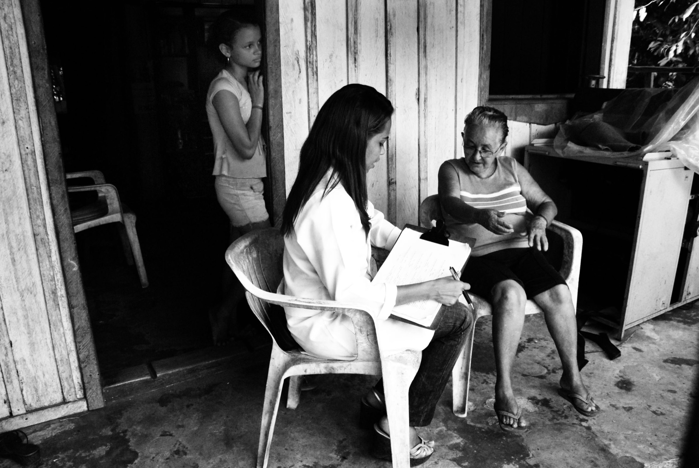

# Spec dos slides 09 (Mercado) e 10 (Go to market)

> Escrito em 23/08/2026. **Especificação, não implementação.** Nenhuma linha do
> `index-v4.html` ou do `pitch.css` foi tocada por este documento.
> Referência de linha: slide 09 = `id="s8"`, slide 10 = `id="s9"`.

---

## 1 · A resposta à pergunta da verba

### 1.1 Ciclo por ciclo, com a reflexão que decidiu cada busca

**Ciclo 1. Por que comecei pelo objeto do pregão, e não pelo valor.**
A pergunta dela é de público-alvo, e a expressão que o deck usa hoje, "promoção de saúde
mental no serviço público", é ambígua em português: pode ser saúde mental *prestada pelo*
serviço público (política para a população) ou saúde mental *de quem trabalha no* serviço
público. O valor homologado não resolve isso; só o objeto resolve. Query: `Pregão Eletrônico
90.001/2026 Central de Compras MGI saúde mental servidores objeto`.
**Achado:** a própria página da Central de Compras do MGI descreve o objetivo da contratação
como oferecer acolhimento a **servidores públicos, empregados públicos, estagiários e
prestadores de serviço** que enfrentam desafios emocionais no cotidiano de trabalho.

**Ciclo 2. Ir à fonte oficial antes de acreditar no resumo.**
Resumo de mecanismo de busca não é fonte; foi exatamente esse erro que derrubou os "R$ 877
milhões" na v1 da `PESQUISA-VERBA-PUBLICA.md`. Tentei ler direto as duas páginas do gov.br
(a notícia de maio de 2026 e a do edital).
**Resultado:** as duas devolvem "Conteúdo Restrito, é necessário autenticar". É a mesma
barreira já registrada na pesquisa anterior (§4 dos limites): as páginas HTML do gov.br
bloqueiam leitura automatizada. **Não obtive leitura primária direta.**

**Ciclo 3. Duas fontes independentes que reproduzem o comunicado oficial.**
Como o gov.br bloqueia, o caminho honesto é cruzar duas casas independentes que citam o
mesmo comunicado. Escolhi o **Zênite** (editora jurídica especializada em licitações, portal
técnico regulamentado) e a **Anasps** (associação nacional de servidores públicos).
**Resultado:** o Zênite devolveu HTTP 403. A Anasps abriu e confirmou objeto, valores,
abrangência e público. **Cruzamento fechado entre a descrição oficial do MGI e a Anasps.**

**Ciclo 4. A pergunta (b) só se responde na norma, não na notícia.**
Saber que o IGD "paga capacitação" por costume não basta: a Mallu quer usar o número como o
que pagaria formação de equipe, e num pitch de aceleradora isso precisa de artigo e inciso.
Duas queries, uma para a norma vigente (`Portaria MDS 1.041/2024 IGD-PBF recursos
capacitação`) e outra para a base legal de origem (`Lei 10.836/2004 artigo 8 IGD-PBF apoio
financeiro capacitação`).

**Ciclo 5. Ler a portaria na página oficial do MDS.**
A busca dá o costume; a página do MDS dá o artigo. Li a página oficial da Portaria no portal
do MDS (`gov.br/mds/.../bolsa-familia/igd/portaria`), que abriu sem bloqueio.
**Achado, e é o que fecha a resposta:** a Portaria MDS nº 1.041/2024 tem base na Lei nº
14.601/2023 e no Decreto nº 12.064/2024, e autoriza expressamente, no **art. 11, IX**,
"desenvolvimento de recursos humanos para atuação nas atividades de cadastramento e de
atendimento às famílias beneficiárias", e no **art. 12, XIII**, "formação e capacitação de
recursos humanos". O **art. 12, § 1º** restringe despesa de pessoal a quem tem dedicação
exclusiva ao Bolsa Família ou ao Cadastro Único, e o **§ 2º** veda pagamento a estagiários e
a menores de 18 anos.

### 1.2 (a) Os R$ 26,9 milhões: para servidores, e não para a população

**Resposta: é para a saúde mental dos próprios servidores públicos. O deck está certo, e
está certo com folga.**

O objetivo declarado da contratação é acolher **servidores públicos, empregados públicos,
estagiários e prestadores de serviço** que enfrentam desafios emocionais e psicológicos no
cotidiano de trabalho. Os serviços registrados na ata são acolhimento psicológico e
psiquiátrico on-line, **atendimento psicossocial em regime de plantão**, palestras e suporte
orientativo às **áreas de gestão de pessoas** e aos gestores.

Três coisas sustentam a leitura, e nenhuma delas depende de interpretação:

1. O serviço é entregue **às áreas de gestão de pessoas**, que só existem para cuidar de
   quem trabalha no órgão. Política para a população nunca passa por gestão de pessoas.
2. O público nomeado inclui **estagiários e prestadores de serviço**, categorias que só fazem
   sentido dentro do vínculo de trabalho.
3. A ata é da **Central de Compras do MGI**, o ministério da gestão e das pessoas do serviço
   público, e não do Ministério da Saúde.

> **Consequência para o deck: nenhuma correção necessária, e uma oportunidade.** A redação
> atual do slide 08 ("Valor destinado pelo Governo Federal em ata para promoção de saúde
> mental no serviço público") é verdadeira, mas deixa a ambiguidade de pé e joga fora o
> argumento mais forte. Quem lê pode entender política para a população. **Nomear o público
> resolve e fortalece:** o maior comprador do país registrou preço para cuidar da saúde
> mental de quem trabalha para ele, que é exatamente a categoria da PAAPS.

**Um limite que continua de pé, e que não é meu para resolver:** os valores da ata seguem
vindo de fontes que reproduzem o comunicado oficial, porque o gov.br bloqueia leitura
automatizada. A conferência definitiva é abrir a Ata nº 41/2026 no Compras.gov.br ou no
Portal Nacional de Contratações Públicas. Não é bloqueante: o número bate em duas casas
independentes. Está listado nas perguntas abertas.

### 1.3 (b) Os R$ 65,9 milhões: o IGD pode pagar formação de equipe, com uma vinculação

**Resposta: sim, se sustenta, e existe artigo e inciso para citar. Mas não é dinheiro livre:
a formação precisa estar ligada à gestão do Bolsa Família e do Cadastro Único.**

| | |
|---|---|
| Norma vigente | Portaria MDS nº 1.041, de 23/12/2024 |
| Base legal | Lei nº 14.601/2023 e Decreto nº 12.064/2024 |
| Autorização direta | **art. 12, XIII: "formação e capacitação de recursos humanos"** |
| Autorização correlata | art. 11, IX: "desenvolvimento de recursos humanos para atuação nas atividades de cadastramento e de atendimento às famílias beneficiárias" |
| Restrição de pessoal | art. 12, § 1º: despesa de pessoal só para quem tem dedicação exclusiva ao PBF ou ao Cadastro Único |
| Restrição de público | art. 12, § 2º: veda pagamento a estagiários e a menores de 18 anos |
| Forma do repasse | fundo a fundo, automático, mensal, do Fundo Nacional de Assistência Social ao Fundo Municipal |
| Sanção pela não execução | acúmulo de saldo excessivo reduz o repasse seguinte |

**O que isso autoriza dizer, e o que não autoriza:**

- ✅ Autoriza dizer que **o dinheiro que paga formação de equipe já está na conta do
  município**, todo mês, e que a rubrica de formação é nominal na norma.
- ✅ Autoriza dizer que **não usar tem custo**: saldo parado reduz o repasse seguinte.
- ❌ **Não** autoriza dizer que o IGD paga formação de qualquer equipe da prefeitura. Ele
  custeia a gestão do Bolsa Família e do Cadastro Único, então a equipe formada é a que atua
  nessas atividades, dentro do Sistema Único de Assistência Social.
- ❌ **Não** autoriza tratar os R$ 65,9 milhões como orçamento disponível para a PAAPS. É o
  total repassado a todos os municípios do país num único mês, e serve como ordem de
  grandeza e como prova de que a rubrica existe, nunca como mercado endereçável.

**A reformulação que salva o dado sem mentir**, e que já é quase a que está no deck, só que
com a sigla resolvida e a vinculação dita:

> R$ 65,9 milhões caíram na conta dos municípios num único mês, pelo IGD, o Índice de Gestão
> Descentralizada, que custeia a gestão do Sistema Único de Assistência Social e tem
> "formação e capacitação de recursos humanos" como rubrica nominal. Saldo parado reduz o
> repasse seguinte.

Fonte falseável para a linha de fonte: `Portaria MDS nº 1.041/2024, art. 12, XIII`.

### 1.4 Fontes desta seção

- Central de Compras do MGI, notícia da licitação centralizada de serviços de promoção da
  saúde mental no serviço público (objeto e público-alvo): `gov.br/gestao`, acesso bloqueado
  a leitura automatizada, conteúdo recuperado via indexação da própria página.
- Anasps, reprodução do comunicado do MGI sobre a Ata nº 41/2026:
  https://anasps.org.br/noticias/servidor-gestao-viabiliza-contratacao-de-servicos-de-promocao-da-saude-mental-na-administracao-publica/
- MDS, página oficial da Portaria do IGD:
  https://www.gov.br/mds/pt-br/acoes-e-programas/bolsa-familia/igd/portaria
- MDS, Informe Bolsa Família nº 46 (valor de maio de 2024), já lido em PDF na
  `PESQUISA-VERBA-PUBLICA.md`.
- MDS, Informe Bolsa Família nº 64 (nova regulamentação do IGD), idem.

---

## 2 · Slide 09 (Mercado): o que sai, o que entra, e a copy

### 2.1 O movimento

| | |
|---|---|
| **Sai** | A célula do **US$ 1,571 trilhão** de patrimônio sob gestão de impacto, inteira, e a linha de fonte do GIIN junto |
| **Entra** | Os **R$ 26,9 milhões** e os **R$ 65,9 milhões**, vindos do slide 08, com o público-alvo nomeado e a sigla IGD resolvida |
| **Fica intacto** | A célula dos **55,2%** (a Mallu gosta do descritivo; **copiada sem uma vírgula de diferença**) |
| **Encurta muito** | A célula internacional, hoje com 340 caracteres, para cerca de 150 |
| **Muda de função** | O **h2**, que hoje resume as três células e passa a carregar a tese |
| **Não mexe** | TAM, SAM e SOM |

### 2.2 O h2: a tese, e a única "não é X, é Y" da peça

Hoje o h2 é um sumário das três células ("Um mercado de impacto em ascensão e flexibilização,
um formato que já é padrão licenciado..."). Com a saída do dado de impacto ele fica
desatualizado de qualquer jeito, e a tese dela é mais forte que qualquer sumário.

> **Não falta dinheiro na rede pública: falta dinheiro alocado onde ele gera impacto. A PAAPS
> trabalha com impacto como premissa, e o que não gera impacto se refaz, porque a base é
> ciência empírica.**

**Por que a estrutura passa no teste da casa:** o X negado é "falta dinheiro na rede
pública", que é crença de gestor, de servidor e de qualquer pessoa que já ouviu "não tem
verba". Não é espantalho. É, aliás, a mesma crença que originou a
`PESQUISA-VERBA-PUBLICA.md`, nas palavras dela: *"quem lê isso pensa 'não existe verba
pública, verba pública tá sempre pobre'. E isso é mentira."*

**Nota de proibição respeitada:** não colei frase curta descritiva depois do título, e não há
chapéu. O h2 sozinho carrega, e as três células provam.

**Nota de tamanho:** o texto encurta de 200 para 175 caracteres, então o corpo da letra pode
subir. Proposta: `clamp(1.15rem,1.95vw,1.95rem)`, contra os `clamp(1.05rem,1.72vw,1.72rem)`
de hoje. Escrever grande é regra da casa.

### 2.3 Primeira célula: a verba

Título da célula (`cel__t`): **A verba já existe**

> **R$ 26,9 milhões** *(maio de 2026)*
> o Governo Federal registrou preço em ata para acolher a saúde mental de **servidores,
> empregados públicos, estagiários e prestadores de serviço**, e **a ata prevê uso por
> estados e municípios**.
>
> **R$ 65,9 milhões** *(maio de 2024)*
> caíram na conta dos municípios num único mês pelo IGD, o índice que custeia a gestão do
> Sistema Único de Assistência Social e tem **formação de equipe como rubrica nominal**.
> **Saldo parado reduz o repasse seguinte.**

**O que mudou em relação ao texto que estava no 08:** entrou o público-alvo nomeado (achado
do ciclo 1, e é ele que fecha a ambiguidade), e "paga formação de equipe" virou "tem formação
de equipe como rubrica nominal", que é o que a Portaria autoriza dizer.

### 2.4 Segunda célula: carreira na psicologia

**Copiada como está. Não reescrever.**

> **55,2%**
> da psicologia brasileira precisa de **mais de um vínculo de trabalho para viver**. O
> Conselho Federal de Psicologia registra, na maior pesquisa já feita sobre a profissão,
> "vínculos precários" e "condições de sobrevivência".

Única sugestão, e é opcional: ganhar um `cel__t` para emparelhar com as outras duas células,
sem tocar no descritivo. Sugestão de título: **A profissão aperta**.

### 2.5 Terceira célula: a frente internacional, encurtada

Corpo, na redação única da seção 4 abaixo:

> **200+**
> organizações no Reino Unido e na Irlanda conduzem um encontro mensal de equipe **desde
> 2009**, sob licença anual do **Schwartz Center**, de Boston, que criou o método.
> **Dezessete anos de um método que se protege e se licencia.**

De 340 para 175 caracteres. Saiu a costura "primeiro da Point of Care Foundation e, desde o
fim de 2025, do...", que é história institucional e pertence à linha de fonte, e saiu "e
atravessa três setores", porque a verificação mostrou que o terceiro setor é ensino superior
com estudantes da área da saúde, e não a educação básica que é a porta da PAAPS.

### 2.6 A linha de fonte do 09

> Ata de Registro de Preços nº 41/2026, Pregão nº 90.001/2026, Central de Compras do MGI,
> para servidores, empregados públicos, estagiários e prestadores · IGD, Índice de Gestão
> Descentralizada: Informe Bolsa Família nº 46, MDS, competência de maio de 2024; formação de
> equipe autorizada pela Portaria MDS nº 1.041/2024, art. 12, XIII · Vínculos na psicologia:
> CensoPsi 2022, Conselho Federal de Psicologia, 20.151 respondentes · Rodas de equipe:
> Schwartz Center for Compassionate Healthcare, licenciador; a Point of Care Foundation
> conduziu o programa de 2009 a 2025 · Municípios: IBGE.

Saiu o GIIN inteiro (91 caracteres). Entraram a ata e a portaria. **Fica em 470 caracteres,
contra os 316 de hoje**, e é o preço de trazer dois dados de verba para cá. Se ela quiser
apertar, a linha que dá para cortar sem perder falseabilidade é a expansão "Índice de Gestão
Descentralizada", já que o corpo da célula explica o que o índice faz; economiza 33
caracteres. **Não corto por conta própria:** a regra da casa é que nenhuma informação fica
sem fonte, e a expansão da sigla foi pedida no `PLANO-AJUSTE-FINO.md` §B.5.

### 2.7 SOM, SAM e TAM: a dependência que ela pediu para conferir

**Conferi, e a dependência existe, nos dois.**

| | Número | Depende do preço da Roda? |
|---|---|---|
| TAM | 5.570 municípios | **Não.** É contagem do IBGE, não tem dinheiro dentro |
| SAM | 2.550 municípios, R$ 724 milhões por ano | **Sim** |
| SOM | 100 municípios, R$ 13,5 milhões no ano 5 | **Sim, e por via documentada** |

**O SOM é o caso fechado.** Os R$ 13,5 milhões são o mesmo número que aparece no slide de
projeções como `R$ 13,52 mi` no ano 5, e a linha de fonte daquele slide declara a premissa em
letra: *"R$ 1.100 por Roda de Equipe, prefeitura atendida diretamente a R$ 924 mil ao ano,
licença anual do método a R$ 64,8 mil"*. **Se o preço da Roda mudar, o SOM muda junto, e a
projeção inteira muda com ele.** Não é ajuste de um slide: é ajuste de dois, mais o anexo.

**O SAM tem um problema pior, e é achado meu, não pedido.** Procurei a derivação dos R$ 724
milhões em todos os arquivos deste projeto e **ela não existe em lugar nenhum**. O número
aparece duas vezes, no `index-v4.html` e no `PLANO-REVISAO-ESTRUTURAL.md`, sempre como
resultado, nunca como conta. Dividindo, dá R$ 283,9 mil por município ao ano, o que a R$
1.100 por Roda equivale a cerca de 21,5 Rodas por mês por município. É um número plausível
para município médio, mas **plausível não é auditável**, e num pitch de aceleradora o SAM é o
primeiro número que um avaliador pede para abrir. Está nas perguntas abertas.

---

## 3 · Os 3 títulos da terceira célula, para AskUserQuestion

Pergunta a fazer a ela: **"Qual título entra na célula da frente internacional do slide 09?"**

### Opção 1
- **Rótulo:** `Método já licenciado lá fora`
- **Descrição:** Responde à pergunta que o avaliador faz primeiro: isso já funcionou em algum lugar? Coloca a prova antes da ambição.
- **Motivo estratégico:** É o título que mais reduz risco percebido. Um formato com dezessete anos de licença ativa prova que a categoria existe e que se paga por ela, o que é exatamente o que sustenta o modelo de licenciamento do slide 10.
- **Risco:** A PAAPS entra como quem chegou depois. Se o avaliador ficar só com esse título, a leitura é "tradução de método estrangeiro", e o diferencial da casa, que é o redesenho da rede pública, some.

### Opção 2
- **Rótulo:** `A PAAPS é prática internacional`
- **Descrição:** Título dela. Coloca a PAAPS dentro de uma linhagem que já existe, em vez de fora dela olhando.
- **Motivo estratégico:** É o único dos três que serve à ambição de internacionalização e ao argumento da maior malha de cuidado do mundo. Muda a pergunta de "isso funciona?" para "onde mais isso vai chegar?".
- **Risco:** É o mais frágil dos três em diligência. A PAAPS não opera fora do Brasil nem tem contrato com o Schwartz Center, então "é prática internacional" pode ser lido como reivindicação de pertencimento sem lastro. Se entrar, o corpo da célula precisa deixar claro que o internacional é o método, e a PAAPS é quem o pratica aqui.

### Opção 3
- **Rótulo:** `Dezessete anos sob licença`
- **Descrição:** O título é o tempo. Não fala de país nem de quem é a PAAPS: fala de durabilidade e de arquitetura de receita.
- **Motivo estratégico:** É o que melhor amarra o 09 ao 10, porque licença anual renovável com preço por número de equipes é a receita que a PAAPS projeta. E é o único que sobrevive intacto quando a Point of Care Foundation aparecer na busca de quem conferir: o que quebrou foi a licenciada intermediária, e a licença sobreviveu.
- **Risco:** É frio. Não diz por que aquilo importa para o Brasil, e obriga o corpo da célula a fazer o trabalho inteiro. Numa leitura rápida, pode passar como nota de rodapé.

**Recomendação, se ela pedir:** a **1**, com o corpo da célula fechando na palavra "licencia",
que é a ponte para o 10. A **2** é a que ela levantou e é a mais bonita, mas é a única que
afirma algo sobre a PAAPS que eu não consigo lastrear em documento, e a casa não deixa passar
dado sem fonte falseável.

> **Um quarto ângulo que considerei e descartei:** "O que o Brasil ainda não tem". É o mais
> forte comercialmente e é **afirmação de inexistência**, o mesmo problema que já derrubou o
> "de forma pioneira na América Latina" na `VERIFICACAO-SCHWARTZ-POINT-OF-CARE.md`. Provar
> que ninguém no Brasil faz isso exige varrer o Brasil inteiro. Registro para ela saber que
> foi pensado e por que não entrou.

---

## 4 · A redação única do argumento britânico, e quem é o dono

### 4.1 O fato, escrito uma vez e certo

> Mais de 200 organizações no Reino Unido e na Irlanda conduzem um encontro mensal de equipe
> desde 2009, sob licença anual do **Schwartz Center for Compassionate Healthcare**, de
> Boston, que criou o método.

**Por que essa redação está correta**, contra o erro do `PLANO-AJUSTE-FINO.md` §A.2: o
Schwartz Center sempre foi o dono do método e sempre licenciou; a Point of Care Foundation
era a **licenciada territorial** do Reino Unido e da Irlanda, sob contrato com o Schwartz
Center, e sublicenciava para cada organização. Desde o fim de 2025 essa camada intermediária
deixou de existir e o Schwartz Center licencia direto. Creditar o Schwartz Center no corpo é
correto para todo o período; creditar a Point of Care Foundation é creditar uma entidade
removida do registro britânico de charities em 15/06/2026.

**A Point of Care Foundation só aparece na linha de fonte**, e sempre nesta forma:

> a Point of Care Foundation conduziu o programa de 2009 a 2025.

### 4.2 A versão curta, para os slides que não são donos

> o mesmo formato roda sob licença anual no Reino Unido e na Irlanda há dezessete anos.

Dezessete caracteres a mais que "desde 2009" e não precisa repetir país, número nem
instituição, porque o slide dono já disse.

### 4.3 Quem é o dono: recomendo o **09**

O `PLANO-AJUSTE-FINO.md` §A.1 apostava no 11. **Discordo, e por um motivo que só apareceu
depois que aquele plano foi escrito.**

1. **O 11 mudou de pergunta.** A decisão 4 da rodada de domingo tira o 11 da concorrência e o
   transforma em slide de categoria: o argumento passa a ser que o mercado inteiro vende uma
   categoria só de intervenção, a individual, e que ela é a de evidência mais fraca. Nesse
   slide o fato britânico não responde mais a "quem mais faz isso": ele vira digressão.
2. **No 09 o fato é a célula inteira.** É o único lugar do deck onde o argumento britânico
   não é apoio de outra coisa: ele é o conteúdo. E é a célula para a qual ela acabou de pedir
   título próprio, o que a torna, por decisão dela, uma das três pernas do slide.
3. **O 10 não precisa do fato, precisa da arquitetura.** O que o Go to market usa não é
   "existem 200 organizações": é "licença anual renovável, com preço definido pelo número de
   equipes atendidas". Isso é um fato diferente, e ele fica no 10 por direito próprio.

**Distribuição proposta:**

| Slide | O que fica |
|---|---|
| **09, dono** | A redação única inteira, na terceira célula |
| **10** | Só a arquitetura da licença. A versão curta da §4.2, se ela quiser o lastro |
| **11** | Nada, ou no máximo a versão curta da §4.2 numa oração subordinada |

Isso mata as três repetições de "Reino Unido", as duas de "traduz esse padrão" e a fonte
idêntica que aparecia em três lugares.

---

## 5 · Slide 10 (Go to market)

### 5.1 O esquema de canais, reescrito com conectivos

**O problema, do `PLANO-AJUSTE-FINO.md` §B.3:** "e já indicam a própria cidade" não tem
sujeito. O leitor precisa voltar duas linhas e adivinhar que quem indica são os Servidores
Públicos. É lista sem nexo, que é o vício que a casa nomeia.

**Reescrita** (`fluxo__t` é a linha forte, `fluxo__d` o destaque, `fluxo__s` a subordinada):

**Passo 1**
- t: `Nossa comunicação fala com os Servidores Públicos`
- s: `e são eles que discutem os próprios dilemas nos nossos comentários`

**Passo 2**
- t: `Cada Servidor Público que nos segue tem o contato do próprio secretário`
- d: `Chegamos de dentro`
- s: `porque são esses mesmos Servidores Públicos que indicam a PAAPS na própria cidade`

**Passo 3**
- t: `E porque a rede já nos conhece, currículos de psicólogas chegam toda semana`
- s: `sem que a gente precise ir atrás`

Três mudanças, e nenhuma é enfeite: entrou o sujeito em "são eles" e "são esses mesmos
Servidores Públicos"; entrou o conectivo causal "porque" duas vezes, que é o que transforma
três fatos numa cadeia; e o passo 3 deixou de ser item solto e passou a ser consequência do
passo 1, que é o que ele sempre foi na prática.

**Léxico:** "servidor público" virou "Servidores Públicos" nos três lugares, conforme a regra
de nomear as pessoas da rede.

**Nota:** o h2 do 10 já usa "só então" (*"e só então consórcio e licença"*). O conectivo que
carrega a ordem do método já está no lugar certo. Não mexi.

### 5.2 A célula do licenciamento, sem a "não é X, é Y"

Ver o conflito na seção 6. Se o 09 ficar com a estrutura, esta célula perde a forma e mantém
o fato inteiro:

> Consórcios públicos, parcerias institucionais e licenciamento do método. **O licenciamento
> tem precedente de dezessete anos:** é assim que esse encontro de equipe chegou a mais de
> 200 organizações no Reino Unido e na Irlanda, em contrato anual renovável, com preço
> definido pelo número de equipes atendidas.

Perde-se a força retórica de "não é aposta nossa" e ganha-se o número, que faz o mesmo
trabalho sem gastar a única estrutura permitida na peça: dezessete anos **é** a resposta a
quem acha que licenciamento é aposta.

### 5.3 A linha de fonte do 10

> Lei 14.133/2021, art. 74, I e art. 75, II · Limite de dispensa de 2026 atualizado pelo
> Decreto nº 12.807/2025 · Consórcios públicos: Lei 11.107/2005 · Licença das rodas de
> equipe: Schwartz Center for Compassionate Healthcare.

Muda uma palavra: "Rodas de equipe no Reino Unido e Irlanda" vira "Licença das rodas de
equipe", porque no 10 o que se credita é a arquitetura da licença, não o país. Também apaga a
duplicata literal com a fonte do 09, que é o §A.3.

### 5.4 O dado de impacto resumido: avaliei, e **recomendo não trazer para o 10**

Ela abriu a porta para os 21% ao ano e a alocação na América Latina virem para cá. Três
motivos para não passarem:

1. **Muda o assunto do slide.** O 10 responde "como a PAAPS chega ao cliente e em quanto
   tempo". Disponibilidade de capital de impacto responde "de onde vem o dinheiro para a
   PAAPS crescer", que é pergunta de investimento, não de go to market. É o mesmo tipo de
   deslocamento que fez o 08 e o 09 se misturarem.
2. **O 10 é o slide mais cheio do deck.** Uma grade de quatro células mais o fluxo de três
   passos. A quinta informação não cabe sem encolher o corpo da letra, e encolher o corpo é a
   última alavanca, nunca a primeira.
3. **Ela mesma deu o motivo de o dado sair:** todo mundo já sabe que o mercado de impacto
   cresce. O motivo não muda de valor porque o dado mudou de slide.

**Onde ele cabe, se ela quiser mesmo salvá-lo:** no slide de **roadmap/projeções (14)**, ou
no de **parceria com a Serasa (13)**, que são os dois lugares onde a pergunta é sobre futuro
e sobre capital. Redação enxuta, pronta, para qualquer um dos dois:

> **46%** dos investidores de impacto planejam **aumentar a alocação na América Latina**, num
> patrimônio que cresce 21% ao ano desde 2019.
> *Fonte: GIIN, State of the Market.*

Isso são 140 caracteres e cabe numa `.cel` ou numa `.tss__l`.

---

## 6 · O conflito das duas "não é X, é Y"

**Existe, e vira decisão dela.** A regra da casa é no máximo uma por peça, e o deck é uma
peça só. Depois desta rodada haveria duas vivas:

| Onde | Frase | O X negado é crença real? |
|---|---|---|
| **09, h2 (nova)** | "Não falta dinheiro na rede pública: falta dinheiro alocado onde gera impacto" | **Sim, e é a mais forte do deck.** É a crença que originou a pesquisa de verba |
| **10, célula de licença (já existe)** | "O licenciamento não é aposta nossa: é assim que esse encontro chegou a 200 organizações" | Sim. Existe gente que lê licenciamento como aposta |

**Recomendo que fique a do 09.** Três motivos:

1. **É tese, e a outra é defesa.** A do 09 muda a leitura do mercado inteiro e reorganiza o
   argumento do deck. A do 10 responde a uma objeção pontual sobre uma linha de receita.
2. **É a única frase do deck que a Mallu ditou como tese.** Está nas palavras dela e é o
   ponto do slide.
3. **A do 10 sobrevive sem a forma.** "O licenciamento tem precedente de dezessete anos" diz
   a mesma coisa e traz um número junto. A do 09 não sobrevive sem a forma: se eu tirar a
   negação, sobra "a rede pública precisa alocar melhor o dinheiro", que é frase de
   consultoria e não toca ninguém.

**Efeito colateral que ela precisa saber:** o `PLANO-AJUSTE-FINO.md` §B.4 já tinha decidido
cortar uma terceira ocorrência, na fonte do slide 14 ("o Diagnóstico 360° a R$ 10 mil é porta
de entrada e não se paga sozinho: é investimento comercial"). Essa decisão continua de pé, e
agora é obrigatória, não opcional.

---

## 7 · HTML proposto, colável, com as classes reais

> Duas classes novas: `cel--duplo` (célula com dois números) e `cel__ano` (o parêntese da
> data). CSS na seção 8. Tudo o mais são classes que já existem.

### 7.1 Slide 09, `id="s8"`

```html
<!-- 08 MERCADO -->
<section class="slide veu-denso" id="s8">
  <div class="slide__foto"></div>
  <p class="canto rev">Mercado</p>
  <div class="slide__c c--centro">
    <h2 class="t-fluxo rev rev--1" style="font-size:clamp(1.15rem,1.95vw,1.95rem);max-width:none">Não falta dinheiro na rede pública: falta dinheiro <span class="destaque">alocado onde ele gera impacto</span>. A PAAPS trabalha com impacto como premissa, e o que não gera impacto se refaz, porque a base é ciência empírica.</h2>
    <div class="grade grade--3 rev rev--2">

      <div class="cel cel--duplo">
        <h3 class="cel__t">A verba já existe</h3>
        <span class="cel__n">R$ 26,9 mi <i class="cel__ano">(maio de 2026)</i></span>
        <p class="cel__l">o Governo Federal registrou preço em ata para acolher a saúde mental de <b>servidores, empregados públicos, estagiários e prestadores de serviço</b>, e <b>a ata prevê uso por estados e municípios</b>.</p>
        <span class="cel__n">R$ 65,9 mi <i class="cel__ano">(maio de 2024)</i></span>
        <p class="cel__l">caíram na conta dos municípios num único mês pelo IGD, o índice que custeia a gestão do Sistema Único de Assistência Social e tem <b>formação de equipe como rubrica nominal</b>. <b>Saldo parado reduz o repasse seguinte.</b></p>
      </div>

      <div class="cel">
        <h3 class="cel__t">A profissão aperta</h3>
        <span class="cel__n">55,2%</span>
        <p class="cel__l">da psicologia brasileira precisa de <b>mais de um vínculo de trabalho para viver</b>. O Conselho Federal de Psicologia registra, na maior pesquisa já feita sobre a profissão, "vínculos precários" e "condições de sobrevivência".</p>
      </div>

      <div class="cel">
        <h3 class="cel__t">Método já licenciado lá fora</h3>
        <span class="cel__n">200+</span>
        <p class="cel__l">organizações no Reino Unido e na Irlanda conduzem um encontro mensal de equipe <b>desde 2009</b>, sob licença anual do <b>Schwartz Center</b>, de Boston, que criou o método. <b class="destaque">Dezessete anos de um método que se protege e se licencia.</b></p>
      </div>

    </div>
    <div class="tss rev rev--3">
      <div class="tss__c">
        <span class="tss__d">TAM</span>
        <span class="tss__n">5.570 municípios</span>
        <p class="tss__l">Todos os municípios do Brasil. Cada um tem servidores em saúde, educação e assistência.</p>
      </div>
      <div class="tss__c">
        <span class="tss__d">SAM</span>
        <span class="tss__n">2.550 municípios</span>
        <p class="tss__l">Os acima de 10 mil habitantes, que comportam contrato direto ou licença: <b>R$ 724 milhões por ano</b>.</p>
      </div>
      <div class="tss__c">
        <span class="tss__d">SOM</span>
        <span class="tss__n">100 municípios</span>
        <p class="tss__l">A meta de cinco anos, 1,8% do total, com <b>R$ 13,5 milhões</b> de receita no ano 5.</p>
      </div>
    </div>
  </div>
  <span class="slide__n">09</span>
  <span class="fonte">Ata de Registro de Preços nº 41/2026, Pregão nº 90.001/2026, Central de Compras do MGI, para servidores, empregados públicos, estagiários e prestadores · IGD, Índice de Gestão Descentralizada: Informe Bolsa Família nº 46, MDS, competência de maio de 2024; formação de equipe autorizada pela Portaria MDS nº 1.041/2024, art. 12, XIII · Vínculos na psicologia: CensoPsi 2022, Conselho Federal de Psicologia, 20.151 respondentes · Rodas de equipe: Schwartz Center for Compassionate Healthcare, licenciador; a Point of Care Foundation conduziu o programa de 2009 a 2025 · Municípios: IBGE.</span>
  <span class="credito">Foto: Radilson Carlos Gomes, fotógrafo do SUS.</span>
</section>
```

**Se ela escolher a opção 2 ou a 3 de título**, trocar só a linha do `cel__t` da terceira
célula por `A PAAPS é prática internacional` ou `Dezessete anos sob licença`. Se escolher a
2, o corpo precisa de um acréscimo de meia linha para não reivindicar o que não temos:
`...que criou o método. <b class="destaque">A PAAPS é quem pratica esse padrão na rede
pública brasileira.</b>`

### 7.2 Slide 10, `id="s9"`

```html
<!-- 09 GO TO MARKET -->
<section class="slide veu-denso" id="s9">
  <div class="slide__foto"></div>
  <p class="canto rev">Go to market</p>
  <div class="slide__c c--centro">
    <h2 class="t-fluxo rev rev--1" style="font-size:clamp(1.02rem,1.62vw,1.62rem);max-width:none">Rede de servidores, comunicação de dentro, diagnóstico por dispensa, e <span class="destaque">só então consórcio e licença</span>.</h2>
    <div class="gtm rev rev--2">

      <div class="cel gtm__fluxo">
        <ol class="fluxo">
          <li class="fluxo__p">
            <span class="fluxo__t">Nossa comunicação fala com os Servidores Públicos</span>
            <span class="fluxo__s">e são eles que discutem os próprios dilemas nos nossos comentários</span>
          </li>
          <li class="fluxo__p">
            <span class="fluxo__t">Cada Servidor Público que nos segue tem o contato do próprio secretário</span>
            <span class="fluxo__d">Chegamos de dentro</span>
            <span class="fluxo__s">porque são esses mesmos Servidores Públicos que indicam a PAAPS na própria cidade</span>
          </li>
          <li class="fluxo__p">
            <span class="fluxo__t">E porque a rede já nos conhece, currículos de psicólogas chegam toda semana</span>
            <span class="fluxo__s">sem que a gente precise ir atrás</span>
          </li>
        </ol>
        <p class="fluxo__pe"><b>Outbound:</b> prospecção por e-mail, automatizada, e a articulação institucional a construir.</p>
      </div>

      <div class="cel">
        <p class="cel__l"><b>Diagnóstico 360<i>°</i></b>, por dispensa: 4 a 5 meses. Proposta do trabalho inteiro: 2 semanas. Parecer e inexigibilidade: 3 semanas. Contrato anual e, na renovação, licença. <b class="destaque">Sete meses até a assinatura.</b></p>
      </div>

      <div class="cel">
        <p class="cel__l"><b>Para a prefeitura:</b> cuidamos de quem cuida, e devolvemos o dado da rede.<br>
        <b>Para a psicóloga:</b> CLT, mora na cidade, supervisão semanal e, após três anos em campo, vira supervisora. <b class="destaque">A carreira que o mercado não oferece.</b></p>
      </div>

      <div class="cel">
        <p class="cel__l">Consórcios públicos, parcerias institucionais e licenciamento do método. <b class="destaque">O licenciamento tem precedente de dezessete anos:</b> é assim que esse encontro de equipe chegou a mais de 200 organizações no Reino Unido e na Irlanda, em contrato anual renovável, com preço definido pelo número de equipes atendidas.</p>
      </div>

    </div>
  </div>
  <span class="slide__n">10</span>
  <span class="fonte">Lei 14.133/2021, art. 74, I e art. 75, II · Limite de dispensa de 2026 atualizado pelo Decreto nº 12.807/2025 · Consórcios públicos: Lei 11.107/2005 · Licença das rodas de equipe: Schwartz Center for Compassionate Healthcare.</span>
  <span class="credito">Foto: AgSUS, Agência Brasileira de Apoio à Gestão do SUS.</span>
</section>
```

---

## 8 · CSS novo

Duas regras, ambas espelhando o que `.pilar--duplo` já faz para o slide 08. Colar junto ao
bloco `.cel` (por volta da linha 361 do `pitch.css`).

```css
/* celula com dois numeros, no modelo do .pilar--duplo do slide 08 */
.cel--duplo .cel__n{font-size:clamp(1.05rem,1.9vw,1.9rem);margin-bottom:.12em}
.cel--duplo .cel__l{margin-bottom:.9em}
.cel--duplo .cel__l:last-child{margin-bottom:0}

/* o parentese da data, ao lado do numero */
.cel__ano{display:block;font-family:var(--corpo);font-style:normal;font-weight:400;
  font-size:clamp(.6rem,.72vw,.72rem);letter-spacing:0;color:var(--bege);margin-top:.15em}
```

**Por que `display:block` e não inline:** na célula de três colunas do `.grade--3` não há
largura para o número e a data na mesma linha sem quebrar palavra. É a mesma decisão que o
`.pilar--duplo .pilar__ano` já tomou no slide 08.

**A medição que falta, e não é minha para fazer:** com dois números, dois descritivos e um
`cel__t`, a primeira célula fica visivelmente mais alta que as outras duas, e o `.grade` iguala
a altura das três. **Isso precisa ser medido no deck rodando**, com os scripts de contagem de
linha e colisão da skill `ajuste-fino-tipografico`, antes de fechar. Se estourar, a ordem das
alavancas é: cortar "de serviço" de "prestadores de serviço"; depois cortar "o índice que
custeia a gestão do Sistema Único de Assistência Social" para "o índice que custeia o SUAS"
(com a expansão migrando para a linha de fonte); e **só então** mexer no corpo da letra.

---

## 9 · Perguntas abertas para a Mallu

### Decisões de copy

1. **Qual dos 3 títulos entra na terceira célula do 09?** (seção 3). Minha recomendação: a 1.
2. **Qual das duas "não é X, é Y" fica?** (seção 6). Minha recomendação: a do 09, e a do 10
   passa a "tem precedente de dezessete anos".
3. **Confirma que o 09 vira o dono do argumento britânico**, e não o 11? (seção 4.3). Isso
   contraria o palpite do `PLANO-AJUSTE-FINO.md`, e o motivo é que o 11 mudou de pergunta na
   rodada de domingo.
4. **A segunda célula ganha o `cel__t` "A profissão aperta"?** O descritivo não muda de
   qualquer forma; é só a etiqueta, para as três células ficarem simétricas. Se ela preferir,
   as três ficam sem título.
5. **O dado de impacto resumido vai para o 14 ou para o 13, ou morre?** (seção 5.4). Minha
   recomendação: não vai para o 10.

### Decisões de número

6. **O preço da Roda continua R$ 1.100?** Ela sinalizou que pode mudar. Se mudar, mudam
   juntos: o SOM do 09, os cinco anos da projeção do 14 e o anexo do 19. **Nenhum desses três
   números pode ser ajustado isoladamente.**
7. **Como os R$ 724 milhões do SAM foram calculados?** A conta não existe em nenhum arquivo
   do projeto. Preciso da fórmula para conferir a dependência do preço e para que o número
   sobreviva a uma pergunta em banca.
8. **Vale abrir a Ata nº 41/2026 no Compras.gov.br antes de submeter?** O valor bate em duas
   fontes independentes, e o gov.br bloqueia leitura automatizada, então a conferência
   primária precisa de alguém com navegador. Não é bloqueante.
9. **Manter "R$ 26,9 mi" ou "R$ 26,9 milhões" na célula?** Abreviei para caber em três
   colunas. Ela já decidiu antes que número grande vai sem caixa; a forma abreviada é
   decisão nova.
